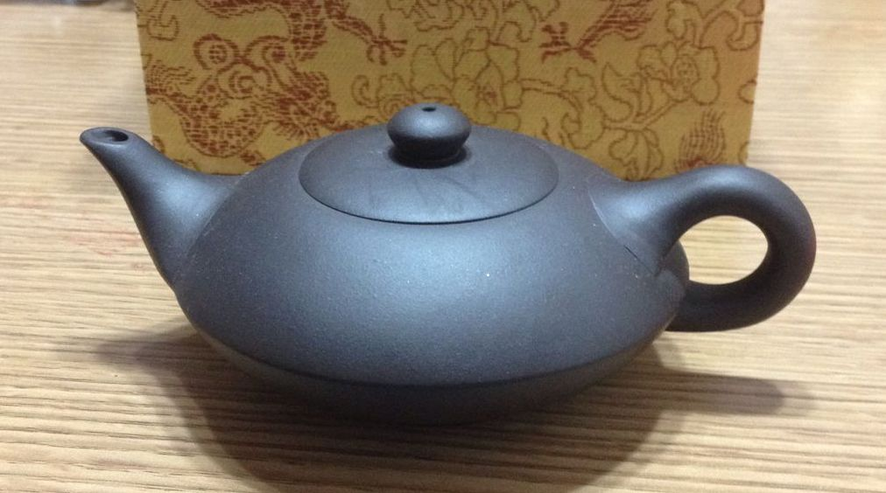

# 假壶

买紫砂壶大多数情况来说只有贵和实惠的区别，比如一把价值200的紫砂壶，我花了2000买了，也只能说我买贵了，被忽悠了，可壶确实是紫砂的，也算不上假货。

但有几种情况确实可称为假货，因为根本用的不是（纯）紫砂。

### 1.灌浆壶

灌浆壶是指紫砂泥料用液体材料稀释，然后灌入模具中制作而成的壶。

关于灌浆壶，知乎问题

<https://www.zhihu.com/question/59255741/answer/164348483>

中的高票答案都是非常精彩的，可以学习一下；我就总结几点好了：

* 由于泥料稀释，壶表面比较细腻，缺少颗粒感，如果你感觉这把紫泥的壶摸着像朱泥，那基本是灌浆的；
* 同样是因为稀释，手感较轻，质感较为粗糙；
* 如果有雕刻的纹饰，那么灌浆壶的纹饰是最浅的，很模糊；
* 淘宝上20以内的都是童叟无欺的灌浆壶，还不清楚话的就买几把看看，其实拿在手里还是挺明显的；50-100的很有可能是做的还不错的灌浆壶，这个就比较要技术了，但相对来说还是能简单区分的；

灌浆壶做的好的话外形很像正常的紫砂壶，但是基本失去了紫砂透气的优点，如果加入的稀释材料有毒就更坑爹了；即使价格非常便宜也没有性价比可言，20块钱还不如买个大玻璃杯子。

### 2.机车壶

###3.拉坯壶

### 4.化工壶

化工壶是最复杂的一种情况。

因为现在很多泥料都会或多或少的添加化学材料，毕竟工艺也是在进步的，有些东西添加了确实对泥料有所提升，有利于降低成本与价格。但是有些东西加了对身体有害，而销售时又以次充好，这种就可以认为是假壶了。下面这把就是比较典型的，泥料颜色邪乎，加之做工粗糙，基本只能拿来养花了。

至于加什么材料会有什么效果，现在也只有一些很基本的知识流于世面，我会在泥料篇总结一下；但不要以为玩家会彻底掌握泥料中的化学知识，这些配方行业内都是各自保密的，外人更不可能弄懂了；只能说尽量买比较常见的、实在的料子比较靠谱。 

### 5.非紫砂壶

